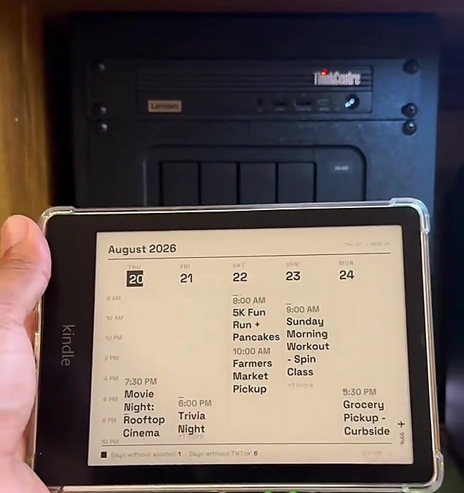
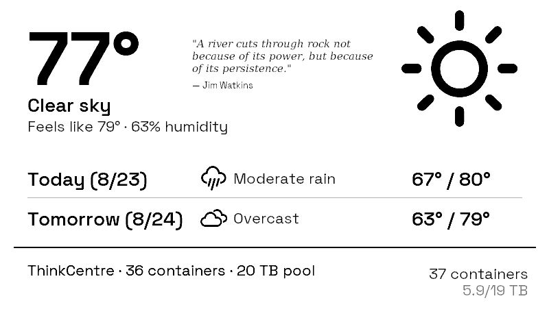
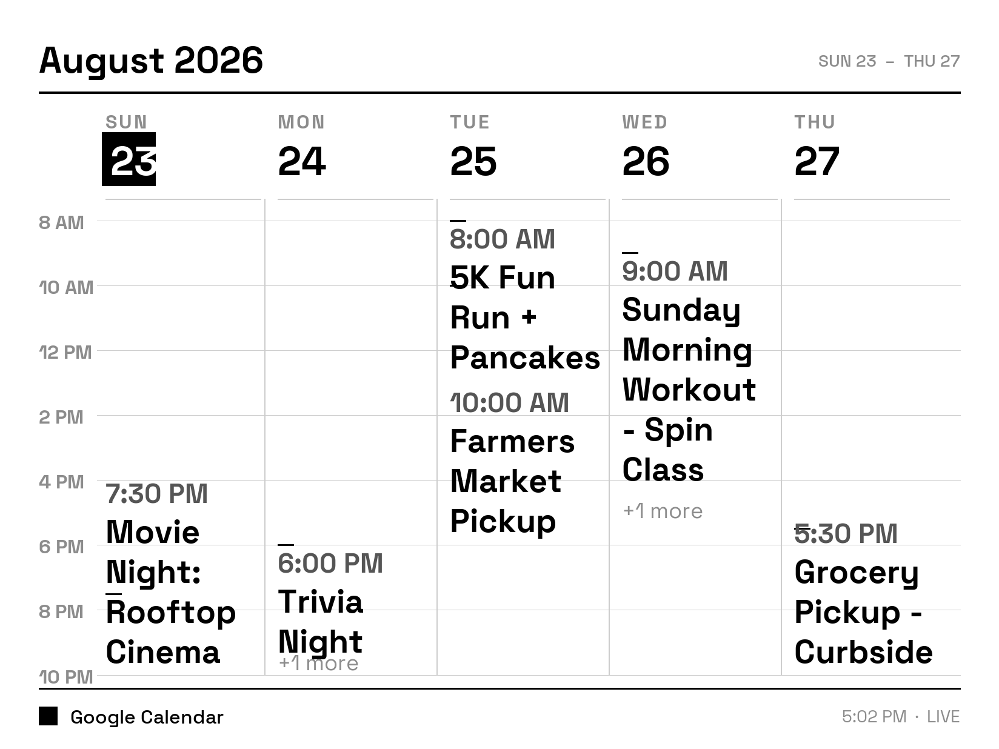

# Kindle Wall Display

Turn a jailbroken Kindle into a low-power wall display that runs for weeks
on a charge instead of the few days you get from leaving a browser open.
It suspends the whole device between refreshes and wakes on a hardware
alarm, so e-ink holds whatever image you last sent it for free while it
sleeps.

The client and the suspend/wake engine are what this repo actually is.
What shows up on the screen is entirely up to your server: point it at
any PNG and the Kindle draws it. It ships with a placeholder image so you
have something to see on day one. See [The placeholder](#the-placeholder).

This is mostly a manual. It ships a small piece of code too.

I had a TRMNL terminal for a few years as an always-on display and loved
it. When an old Kindle ended up sitting in a drawer, I gave it the same
job for free. My own server renders a calendar, because that's what I
wanted on my wall, but a calendar is just my use case, not the point of
this project.

<table>
<tr>
<td width="50%"></td>
<td width="50%"></td>
</tr>
<tr>
<td align="center">The TRMNL terminal, the inspiration</td>
<td align="center">The Kindle, running the same idea for free</td>
</tr>
</table>

Here is what my own server renders, as one example of what's possible. Sample
events stand in for a real week so the layout is easy to read:

<table>
<tr>
<td width="50%"></td>
<td width="50%"></td>
</tr>
<tr>
<td align="center">The TRMNL: weather, a quote, and server stats</td>
<td align="center">The Kindle: a week of sample events</td>
</tr>
</table>

## Quick start

1. **Jailbreak your Kindle.** Check your firmware version, then use the
   [kindlemodding.org Jailbreak Wizard](https://kindlemodding.org/jailbreak-wizard.html)
   to find the right one. See [Jailbreak](#jailbreak) for older devices.
2. **Install KUAL and MRPI** using
   [kindlemodding.org's guide](https://kindlemodding.org/jailbreaking/post-jailbreak/installing-kual-mrpi/).
3. **Stand up a display server** on your LAN. Self-host
   [byos_fastapi](https://github.com/usetrmnl/byos_fastapi) and serve
   [the placeholder](#the-placeholder) to start, or write a plugin that
   returns your own PNG right away. See [The server](#the-server).
4. **Copy `kindle/trmnlcal/` to `extensions/trmnlcal/`** on the Kindle over
   USB, and set the `SERVER` line in `bin/calendar.sh` to your server's
   address.
5. **Open KUAL > TRMNL Calendar > Test once.** Confirms the server
   connection and drawing work.
6. **Run Suspend test (2 min).** Read the verdict before trusting suspend
   on your device.
7. **If it passes,** create an empty `suspend.enabled` file next to
   `calendar.log` over USB, then run **Start calendar display**.

Step 7 is deliberate. Without that file the loop refreshes fully awake:
days of battery instead of weeks, but it can never fail to wake up.

If a step does not work, see [Troubleshooting](#troubleshooting).

## What you need

- **A jailbroken Kindle.** Proven on a Paperwhite 5 Signature Edition,
  firmware 5.19.2, jailbroken with SpringBreak. That is the only device
  this has actually run on. Other models likely work, but panel size and
  DPI vary, so your server-side renderer needs to match your panel.
- **A USB cable.** No SSH, no USBNetwork, no on-device shell. Installing is
  a plain USB copy, on purpose.
- **A machine on your LAN** for the display server. A Raspberry Pi is
  plenty.
- **A plugin that renders whatever you want to a PNG.** You write this. The
  repo ships a placeholder so you have something to serve on day one. See
  [The placeholder](#the-placeholder) and [The server](#the-server).

## Jailbreak

**This repo does not host, mirror, or explain how to obtain jailbreak
files.** Jailbreak tooling changes as Amazon patches firmware, and a stale
copy here would eventually be wrong in a way that could brick someone's
device. Jailbreaking voids your warranty and it is your own risk.

Find your firmware under **Settings > All Settings > Device Options >
Device Info**, then start at
[kindlemodding.org](https://kindlemodding.org). Their
[Jailbreak Wizard](https://kindlemodding.org/jailbreak-wizard.html) tells
you which jailbreak applies to your exact model and firmware. Mine used
**SpringBreak** (Kindle Touch 5, PW5/SE on 5.19.2+, KT4/PW4 on 5.18.1.1.1+).

On older hardware or firmware you need an older jailbreak:

- **WinterBreak**, Kindle 5th generation and newer, firmware through
  5.18.0.
- **KindleBreak** (2021, via the KindleDrip exploit), for Paperwhite 2/3/4,
  Oasis 1/2/3, Voyage, and basic Kindles 8th to 10th generation on firmware
  5.10.3 to 5.13.3.

The [MobileRead Kindle Developer's Corner](https://www.mobileread.com/forums/forumdisplay.php?f=150)
is the forum behind most of this work, and worth searching if your
device is not covered cleanly.

Come back once you can see a `JAILBROKEN.txt` file on the device.

## What this is built on

None of the following is mine, and this would not exist without it.

- **[KUAL](https://github.com/KindleTweaks/PEKI)**, the launcher that runs
  extensions like this one. I use the PEKI build, which does not need MRPI
  to install itself.
- **MRPI**, the package installer used to install KUAL. Get it from
  kindlemodding.org's post-jailbreak guide and check its `VERSION` file for
  the supported firmware range.
- **[kindle-dash](https://github.com/pascalw/kindle-dash)** by Pascal
  Widdershoven. The suspend-to-RAM approach, arming an RTC alarm and
  suspending between refreshes, comes from here. `calendar.sh`'s screen
  takeover ordering follows it directly. I did not invent this pattern.
- **[FBInk](https://github.com/NiLuJe/FBInk)** by NiLuJe, which does the
  actual drawing. It is already on a jailbroken device; this script just
  calls it.

## The server

`calendar.sh` needs a TRMNL-style display API. Two endpoints:

- **`GET /api/display`**, called each cycle with `ID`, `Access-Token`, and
  `FW-Version` headers. Returns JSON with an `image_url` field.
- **`POST /api/log`**, optional. The device posts a tail of its own log so
  you can see what it is doing without a USB trip.

I run a self-hosted fork of
**[usetrmnl/byos_fastapi](https://github.com/usetrmnl/byos_fastapi)** by
Rui Carmo, building on [@ohAnd](https://github.com/ohAnd/trmnlServer)'s
earlier work. That code is not shipped here. Clone and self-host it
yourself. [TRMNL](https://trmnl.com) is the company this API shape comes
from, and they sell their own hardware if you would rather buy than build.

The plugin that renders my own calendar into a PNG lives in my server
fork, not here. It is wired into personal infrastructure I would have to
strip out first, so what you get here is the client, the API contract
above, and a placeholder image to serve while you write your own plugin.

## The placeholder

[`assets/placeholder.png`](assets/placeholder.png) is what a fresh install
shows: 1236x1648, 8-bit grayscale, sized for the Paperwhite 5 panel. It
says so on the screen, on purpose, so there's no doubt about whether your
setup is working or whether you're just looking at a stale render.

To use it, point your server's `GET /api/display` response at this file
until you have your own plugin. Once your Kindle is drawing it, everything
in [Quick start](#quick-start) is confirmed working end to end: the
jailbreak, KUAL, the network path to your server, and the suspend cycle.
From there, replacing it is just a matter of pointing that same response
at a different PNG. Your Kindle picks up the change on its next refresh
cycle, no USB trip needed.

What you serve after that is entirely yours to decide. A calendar is what
I built, because it's what I wanted on my wall, but the client doesn't
know or care what the image is. A few things that would work just as
well:

- A calendar
- The weather
- Family photos on rotation
- Server or homelab stats
- Departure times for the bus or train

Anything that fits in a 1236x1648 grayscale PNG and that you're willing to
regenerate every refresh cycle works.

## The extension

```
kindle/trmnlcal/
├── config.xml       KUAL extension manifest
├── menu.json        KUAL menu
└── bin/calendar.sh  the extension, POSIX sh
```

Install by copying that folder to `extensions/trmnlcal/` on the Kindle over
USB, then editing the `SERVER` line near the top of `calendar.sh`:

```sh
SERVER="${TRMNL_SERVER:-http://CHANGE_ME_SERVER_HOST:8484}"
```

`DEVICE` and the `Access-Token` header below it are plain identifiers, not
secrets. The defaults are fine for a single Kindle.

Menu actions under **KUAL > TRMNL Calendar**:

| Action | What it does |
| --- | --- |
| Test once | Fetches and draws one frame. Run this first. |
| Suspend test (2 min) | Arms an alarm, suspends once, reports a verdict. Run before trusting suspend. |
| Suspend test WITH takeover | Same, but stops the reader framework first, the way the real loop does. |
| Start calendar display | Starts the refresh loop. |
| Stop and restore Kindle | Stops everything, hands the device back. |
| Diagnose probes | Prints which RTC, HTTP client, and battery source it found. |
| Show type ruler | Pixel sizing reference for tuning fonts on a new panel. |

The comments inside `calendar.sh` are working engineering notes, dated to
when they were written. Some are stale. [Known issues](#known-issues) below
is the current status.

## What makes this different

Most Kindle dashboard tutorials either leave a browser open on a page, or
run a script that redraws on a timer without ever suspending. Both leave
the device functionally awake, which is why they get days of battery
instead of weeks.

This suspends the device to RAM between refreshes and wakes on a hardware
alarm. E-ink holds the last image with no power while suspended, so the
gap between one refresh and the next costs almost nothing. Measured on
clean overnight runs: about 0.15% per hour, roughly a month per charge.

On top of the base suspend/wake pattern from kindle-dash, this adds:

- A wireless update channel. Push a new `calendar.sh` over Wi-Fi with a
  sha256 and syntax check before it applies, and an automatic revert if the
  new version never completes a healthy cycle. No USB trip per fix.
- A watchdog process that restarts the refresh loop if it goes stale.
- A second RTC alarm as backup where the hardware supports it.
- Wi-Fi recovery that hard-resets the radio and retries instead of handing
  the device back to its own power management, which caused the worst early
  outages.

The goal is months of battery, unattended. Staying awake for reliability is
a last resort the code falls back to after repeated suspend failures, not a
fix.

## Troubleshooting

Start with the log. Everything the client does is written to
`calendar/calendar.log` on the Kindle's USB drive, which is
`/mnt/us/calendar/calendar.log` on the device. The watchdog keeps a second,
smaller log beside it at `calendar/watchdog.log`. Neither file exists until you
run a menu action once, because the script creates that folder on first run.

You usually don't need USB to read it. Every cycle POSTs the tail of the same log
to your server's `POST /api/log`. If you run byos_fastapi in Docker:

```sh
docker logs trmnl-server 2>&1 | grep KINDLE_LOG
```

Then run **KUAL > TRMNL Calendar > Diagnose probes**. It draws a card on the panel
and writes the same as a `PROBE` line to the log: Wi-Fi interface, signal, battery
source, HTTP client, and RTC alarm path. Most first-install problems are visible
on that one card.

Two habits that save time:

- **Eject and unplug before using KUAL.** Files you copy over USB, including
  `suspend.enabled` and `stop.flag`, are only visible to the device once it is
  disconnected.
- **A power-button restart always undoes everything.** The screen takeover is not
  persistent, so restarting the Kindle hands it back to the reader even if the
  script never got to clean up.

### KUAL shows no TRMNL Calendar menu

The extension has to sit at `extensions/trmnlcal/` with `config.xml` and
`menu.json` directly inside it. Unzipping often produces a nested
`trmnlcal/trmnlcal/`, which KUAL ignores. Confirm
`extensions/trmnlcal/bin/calendar.sh` exists, then leave and re-enter KUAL, since
it reads the menu when it launches.

### Test once draws nothing

The first thing to check is the `SERVER` line in `bin/calendar.sh`. Left at
`CHANGE_ME_SERVER_HOST` it fails on every fetch. After that, match the last lines
of `calendar.log` against this table.

| Log line | What it means |
| --- | --- |
| `ERROR no image_url in response` | The `GET /api/display` call returned, but the JSON has no `image_url` field. Fix the server plugin, or point it at [the placeholder](#the-placeholder). |
| `ERROR download failed, keeping previous screen` | The `image_url` itself was unreachable from the device. It is often a hostname the Kindle can't resolve, or a URL only valid on the server. |
| `ERROR empty download, keeping previous screen` | The image URL answered with zero bytes. |
| `ERROR no working display tool (fbink or eips)` | FBInk was not at `/mnt/us/libkh/bin/fbink` and `eips` was not on the path either. Nothing can draw until one of them is present. |
| `ERROR no curl or wget on this device, cannot fetch` | No HTTP client. Diagnose probes shows this as `http client: NONE`. |

An empty log after **Test once** means the script never ran at all. Recheck the
install path above.

### The image is stale, but the device is otherwise alive

Every refresh writes one `CYCLE` line. A healthy one reads:

```
CYCLE n=12 batt=71 wifi=4s fetch=ok interval=900(served)
```

- `wifi=FAIL(63s) fetch=skipped` — the radio did not rejoin the access point.
  This is [known issue (A)](#known-issues). The loop keeps the last image, keeps
  suspending, and retries on each wake. Battery is unaffected and it has always
  recovered on its own.
- `fetch=FAIL` — the network came back but the fetch or the download failed. Use
  the table above for the specific `ERROR` line just before it.
- `interval=900(default)` instead of `(served)` — your server's `refresh_rate`
  was missing or outside the accepted 300 to 21600 seconds, so the built-in
  fallback was used.

### Battery drains in days instead of weeks

The loop only suspends when a file named `suspend.enabled` exists in the
`calendar/` folder. Nothing creates it for you, not even a passing suspend test.
The startup line says which mode you got:

```
loop started pid 8123 fallback_interval 900s suspend=enabled
```

`suspend=locked` means the file was not found. If it says `enabled` and the drain
is still fast, look for these:

- `ERROR RTC alarm did not arm or read back` — the script refuses to suspend
  unless it can read the alarm back from the RTC.
- `ERROR suspend write refused` — the kernel rejected the sleep.
- `ERROR suspend did not hold: slept 223s of 900s` — it woke early. This is
  [known issue (B)](#known-issues).

Three of those in a row and the loop logs `suspend abandoned this run` and stays
awake deliberately for the rest of that run. The display keeps working; battery
becomes days-class. Stop and start the loop to try suspending again.

### The loop won't stop

Use **Stop and restore Kindle**. It kills the watchdog first, then the loop, then
disarms the alarm and restarts the reader framework. Killing the loop any other
way does not stop it: the watchdog treats a dead loop as the fault it was built
for. It checks the heartbeat file every two minutes and relaunches the loop once
that file is more than 40 minutes old.

With no way into KUAL, create an empty file named `stop.flag` in the `calendar/`
folder over USB. The loop finds it on its next wake, renames it `stop.flag.done`,
restores the reader, and exits. The watchdog sees the same flag and exits without
restarting anything. On a suspending device this takes up to one refresh interval.

The watchdog never restarts anything silently. Every restart it performs appears
in the main log as a `WATCHDOG` line and is pushed to the server with everything
else.

## Known issues

Two bugs are open. If you build this, you should know about them.

**(A) Wi-Fi sometimes won't reconnect.** The Kindle still wakes on
schedule every time, so the alarm and suspend cycle are fine, but the radio
won't rejoin the access point for hours. Worst case so far was about 33
hours, and it recovered on its own. Battery is unaffected, since it keeps
suspending normally between retries. What you lose is a fresh image, not
runtime. I've added diagnostic logging but haven't found the cause yet.

**(B) A suspend that doesn't hold can leave the screen stale.** Sometimes a
suspend returns early instead of holding for the full interval. The script
falls back to staying awake rather than risk never waking, which is the
safe choice, but a timing bug in that fallback let it lose track of real
elapsed time and sit idle for nearly two hours with nothing reporting a
problem.

The silent part is fixed in the current version. The fallback now checks
wall-clock time against a budget and returns to a normal refresh cycle
instead of drifting, and it reports itself to the server so you can see it
without pulling the device log. What I still don't know is why the suspend
fails in the first place. I've instrumented it to capture what wakes the
device, so the next occurrence should answer that.

Neither bug has caused data loss or bricked anything. Both recover on their
own. If you get impatient, one power button press and KUAL > TRMNL Calendar
> Start calendar display brings it back.

## License

The code in this repo (`kindle/trmnlcal/`) is MIT-licensed. See
[LICENSE](LICENSE).

That does not extend to anything you install alongside it:

- **byos_fastapi** is a separate MIT-licensed project. Review its license
  directly. Nothing here modifies or inherits it.
- **FBInk** is GPLv3+. This repo does not distribute it, so no obligation
  flows from here, but if you ever bundle FBInk's binary with something you
  build on this, GPLv3+ applies to that.
- **KUAL, MRPI, and the jailbreak** each have their own terms set by their
  maintainers. This repo distributes none of them.
