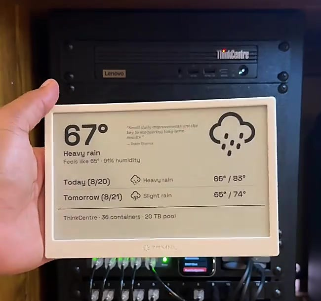

# Kindle Wall Calendar

Turn a jailbroken Kindle into a wall calendar that runs for weeks on a
charge instead of the few days you get from leaving a browser open. It
suspends the whole device between refreshes and wakes on a hardware alarm,
so e-ink holds the image for free while it sleeps.

This is mostly a manual. It ships a small piece of code too.

I had a TRMNL terminal for a few years as an always-on display and loved
it. When an old Kindle ended up sitting in a drawer, I gave it the same
job for free.

<table>
<tr>
<td width="50%"></td>
<td width="50%"><em>[Kindle calendar photo pending, see note below]</em></td>
</tr>
<tr>
<td align="center">The TRMNL terminal, the inspiration</td>
<td align="center">The Kindle, running the same idea for free</td>
</tr>
</table>

## Quick start

1. **Jailbreak your Kindle.** Check your firmware version, then use the
   [kindlemodding.org Jailbreak Wizard](https://kindlemodding.org/jailbreak-wizard.html)
   to find the right one. See [Jailbreak](#jailbreak) for older devices.
2. **Install KUAL and MRPI** using
   [kindlemodding.org's guide](https://kindlemodding.org/jailbreaking/post-jailbreak/installing-kual-mrpi/).
3. **Stand up a display server** on your LAN. Self-host
   [byos_fastapi](https://github.com/usetrmnl/byos_fastapi) and write a
   plugin that returns a calendar PNG. See [The server](#the-server).
4. **Copy `kindle/trmnlcal/` to `extensions/trmnlcal/`** on the Kindle over
   USB, and set the `SERVER` line in `bin/calendar.sh` to your server's
   address.
5. **Open KUAL > TRMNL Calendar > Test once.** Confirms the server
   connection and drawing work.
6. **Run Suspend test (2 min).** Read the verdict before trusting suspend
   on your device.
7. **If it passes,** create an empty `suspend.enabled` file next to
   `calendar.log` over USB, then run **Start calendar display**.

Step 7 is deliberate. Without that file the loop refreshes fully awake:
days of battery instead of weeks, but it can never fail to wake up.

## What you need

- **A jailbroken Kindle.** Proven on a Paperwhite 5 Signature Edition,
  firmware 5.19.2, jailbroken with SpringBreak. That is the only device
  this has actually run on. Other models likely work, but panel size and
  DPI vary, so your server-side renderer needs to match your panel.
- **A USB cable.** No SSH, no USBNetwork, no on-device shell. Installing is
  a plain USB copy, on purpose.
- **A machine on your LAN** for the display server. A Raspberry Pi is
  plenty.
- **A plugin that renders your calendar to a PNG.** You write this. See
  [The server](#the-server).

## Jailbreak

**This repo does not host, mirror, or explain how to obtain jailbreak
files.** Jailbreak tooling changes as Amazon patches firmware, and a stale
copy here would eventually be wrong in a way that could brick someone's
device. Jailbreaking voids your warranty and it is your own risk.

Find your firmware under **Settings > All Settings > Device Options >
Device Info**, then start at
[kindlemodding.org](https://kindlemodding.org). Their
[Jailbreak Wizard](https://kindlemodding.org/jailbreak-wizard.html) tells
you which jailbreak applies to your exact model and firmware. Mine used
**SpringBreak** (Kindle Touch 5, PW5/SE on 5.19.2+, KT4/PW4 on 5.18.1.1.1+).

On older hardware or firmware you need an older jailbreak:

- **WinterBreak**, Kindle 5th generation and newer, firmware through
  5.18.0.
- **KindleBreak** (2021, via the KindleDrip exploit), for Paperwhite 2/3/4,
  Oasis 1/2/3, Voyage, and basic Kindles 8th to 10th generation on firmware
  5.10.3 to 5.13.3.

The [MobileRead Kindle Developer's Corner](https://www.mobileread.com/forums/forumdisplay.php?f=150)
is the forum behind most of this work, and worth searching if your
device is not covered cleanly.

Come back once you can see a `JAILBROKEN.txt` file on the device.

## What this is built on

None of the following is mine, and this would not exist without it.

- **[KUAL](https://github.com/KindleTweaks/PEKI)**, the launcher that runs
  extensions like this one. I use the PEKI build, which does not need MRPI
  to install itself.
- **MRPI**, the package installer used to install KUAL. Get it from
  kindlemodding.org's post-jailbreak guide and check its `VERSION` file for
  the supported firmware range.
- **[kindle-dash](https://github.com/pascalw/kindle-dash)** by Pascal
  Widdershoven. The suspend-to-RAM approach, arming an RTC alarm and
  suspending between refreshes, comes from here. `calendar.sh`'s screen
  takeover ordering follows it directly. I did not invent this pattern.
- **[FBInk](https://github.com/NiLuJe/FBInk)** by NiLuJe, which does the
  actual drawing. It is already on a jailbroken device; this script just
  calls it.

## The server

`calendar.sh` needs a TRMNL-style display API. Two endpoints:

- **`GET /api/display`**, called each cycle with `ID`, `Access-Token`, and
  `FW-Version` headers. Returns JSON with an `image_url` field.
- **`POST /api/log`**, optional. The device posts a tail of its own log so
  you can see what it is doing without a USB trip.

I run a self-hosted fork of
**[usetrmnl/byos_fastapi](https://github.com/usetrmnl/byos_fastapi)** by
Rui Carmo, building on [@ohAnd](https://github.com/ohAnd/trmnlServer)'s
earlier work. That code is not shipped here. Clone and self-host it
yourself. [TRMNL](https://trmnl.com) is the company this API shape comes
from, and they sell their own hardware if you would rather buy than build.

**One gap:** the plugin that renders my calendar into a PNG lives in my
server fork, not here. It is wired into personal infrastructure I would
have to strip out first, so for now you get the client and the API
contract above and you write the plugin. For a Paperwhite 5, target
1236x1648 portrait, 8-bit grayscale.

## The extension

```
kindle/trmnlcal/
├── config.xml       KUAL extension manifest
├── menu.json        KUAL menu
└── bin/calendar.sh  the extension, POSIX sh
```

Install by copying that folder to `extensions/trmnlcal/` on the Kindle over
USB, then editing the `SERVER` line near the top of `calendar.sh`:

```sh
SERVER="${TRMNL_SERVER:-http://CHANGE_ME_SERVER_HOST:8484}"
```

`DEVICE` and the `Access-Token` header below it are plain identifiers, not
secrets. The defaults are fine for a single Kindle.

Menu actions under **KUAL > TRMNL Calendar**:

| Action | What it does |
| --- | --- |
| Test once | Fetches and draws one frame. Run this first. |
| Suspend test (2 min) | Arms an alarm, suspends once, reports a verdict. Run before trusting suspend. |
| Suspend test WITH takeover | Same, but stops the reader framework first, the way the real loop does. |
| Start calendar display | Starts the refresh loop. |
| Stop and restore Kindle | Stops everything, hands the device back. |
| Diagnose probes | Prints which RTC, HTTP client, and battery source it found. |
| Show type ruler | Pixel sizing reference for tuning fonts on a new panel. |

The comments inside `calendar.sh` are working engineering notes, dated to
when they were written. Some are stale. [Known issues](#known-issues) below
is the current status.

## What makes this different

Most Kindle dashboard tutorials either leave a browser open on a page, or
run a script that redraws on a timer without ever suspending. Both leave
the device functionally awake, which is why they get days of battery
instead of weeks.

This suspends the device to RAM between refreshes and wakes on a hardware
alarm. E-ink holds the last image with no power while suspended, so the
gap between one refresh and the next costs almost nothing. Measured on
clean overnight runs: about 0.15% per hour, roughly a month per charge.

On top of the base suspend/wake pattern from kindle-dash, this adds:

- A wireless update channel. Push a new `calendar.sh` over Wi-Fi with a
  sha256 and syntax check before it applies, and an automatic revert if the
  new version never completes a healthy cycle. No USB trip per fix.
- A watchdog process that restarts the refresh loop if it goes stale.
- A second RTC alarm as backup where the hardware supports it.
- Wi-Fi recovery that hard-resets the radio and retries instead of handing
  the device back to its own power management, which caused the worst early
  outages.

The goal is months of battery, unattended. Staying awake for reliability is
a last resort the code falls back to after repeated suspend failures, not a
fix.

## Known issues

Two bugs are open. If you build this, you should know about them.

**(A) Wi-Fi sometimes won't reconnect.** The Kindle still wakes on
schedule every time, so the alarm and suspend cycle are fine, but the radio
won't rejoin the access point for hours. Worst case so far was about 33
hours, and it recovered on its own. Battery is unaffected, since it keeps
suspending normally between retries. What you lose is a fresh image, not
runtime. I've added diagnostic logging but haven't found the cause yet.

**(B) A suspend that doesn't hold can leave the screen stale.** Sometimes a
suspend returns early instead of holding for the full interval. The script
falls back to staying awake rather than risk never waking, which is the
safe choice, but a timing bug in that fallback let it lose track of real
elapsed time and sit idle for nearly two hours with nothing reporting a
problem.

The silent part is fixed in the current version. The fallback now checks
wall-clock time against a budget and returns to a normal refresh cycle
instead of drifting, and it reports itself to the server so you can see it
without pulling the device log. What I still don't know is why the suspend
fails in the first place. I've instrumented it to capture what wakes the
device, so the next occurrence should answer that.

Neither bug has caused data loss or bricked anything. Both recover on their
own. If you get impatient, one power button press and KUAL > TRMNL Calendar
> Start calendar display brings it back.

## License

The code in this repo (`kindle/trmnlcal/`) is MIT-licensed. See
[LICENSE](LICENSE).

That does not extend to anything you install alongside it:

- **byos_fastapi** is a separate MIT-licensed project. Review its license
  directly. Nothing here modifies or inherits it.
- **FBInk** is GPLv3+. This repo does not distribute it, so no obligation
  flows from here, but if you ever bundle FBInk's binary with something you
  build on this, GPLv3+ applies to that.
- **KUAL, MRPI, and the jailbreak** each have their own terms set by their
  maintainers. This repo distributes none of them.
